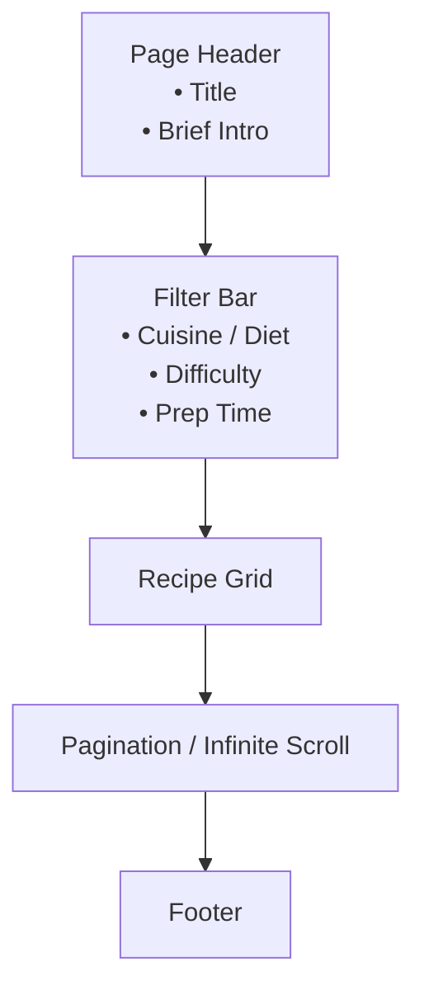

# Food Recipe Web App – Design Mockups

> **Purpose**  
> Translate business goals and UX requirements into clear, visual blueprints before the development phase. These mockups act as the contract between design and engineering.

---

## 1. Design Vision & Style Guide

| Category      | Spec                                                                                        |
|---------------|---------------------------------------------------------------------------------------------|
| **Brand Feel**| Friendly, fresh, and inspiring—celebrating the joy of cooking and seasonal ingredients.      |
| **Color**     | `#FF7043` (primary accent), `#FFE0B2` (secondary), `#37474F` (text dark), `#F5F5F5` (bg).    |
| **Typography**| Headlines → `Poppins`, regular → `Inter`.                                                    |
| **Spacing**   | Base unit **8 px**; use multiples for rhythm (16 px, 24 px, 32 px...).                       |
| **Corner R.** | 12 px for cards & inputs.                                                                   |
| **Shadows**   | Subtle `0 2px 4px rgba(0,0,0,0.06)` for card elevation.                                      |
| **Breakpoints**| `sm` ≤ 640 px, `md` ≤ 768 px, `lg` ≤ 1024 px, `xl` > 1280 px.                              |

> ✨ **Note:** All wireframes below are *lo-fi* representations. Final UI will be refined with imagery, illustrations, and micro-interactions during implementation.

---

## 2. Homepage Wireframe

```mermaid
flowchart TB
    A[Navigation Bar]
    B[Hero Section\n• BG image or video\n• Catchy Tagline\n• CTA button]
    C[Search Bar]
    D[Featured Recipes\nCard Grid (3–6)]
    E[Seasonal Recipes\nCard Grid]
    F[Newsletter Signup]
    G[Footer]

    A --> B --> C --> D --> E --> F --> G
```

### Component Call-outs
1. **Navigation Bar** – Sticky at top, includes logo, primary links, and a compact search icon for mobile.
2. **Hero Section** – 100 vh on desktop; parallax scroll for depth. CTA leads to *Recipes*.
3. **Search Bar** – Full-width input with category filter dropdown.
4. **Featured/Seasonal Recipes** – Responsive grid (auto-fill min 280 px). Hover reveals quick-view overlay.
5. **Newsletter Signup** – Contrasting block with dimmed food background.
6. **Footer** – Secondary nav, socials, rights.

---

## 3. Recipe Detail Page Wireframe

```mermaid
flowchart LR
    A[Back ←]
    B[Recipe Title + Summary]
    C[Media\n(Main Image / Carousel / Video)]
    D[Ingredients\n• Checklist]
    E[Instructions\n• Step-by-step]
    F[Side Info\n• Nutrition\n• Tips\n• Ratings]
    G[Reviews]
    H[Related Recipes]

    A --> B --> C
    C --> D
    D --> E
    E --> F
    F --> G
    G --> H
```

### Layout
- **Desktop**: Two-column (70 / 30) where ingredients & instructions sit left; nutrition/tips sticky on right.
- **Mobile**: Single-column stacking; sticky *Cook Mode* button that jumps to active step.

---

## 4. Cuisines & Dietary Listing Pages



### Interaction Notes
- Filters open as modal sheet on small screens.
- Grid items animate in (fade + up) on scroll.
- Infinite scroll with sentinel element; fallback pagination for SEO.

---

## 5. Accessibility (a11y)
1. Color contrast ≥ 4.5:1 for text.
2. Keyboard navigation ordered logically.
3. Semantic HTML landmarks (header, main, nav, footer, aside).
4. Alt tags for images & ARIA labels for interactivity.

---

## 6. Next Steps
1. **Feedback Loop** – Stakeholder sign-off on these mockups.
2. **High-fi Design** – Produce polished visuals (Figma) aligned with brand.
3. **Component Library** – Translate into reusable React + Tailwind UI components.
4. **Implementation** – Begin coding per *src/components* structure.

> _End of design mockups v1.0_